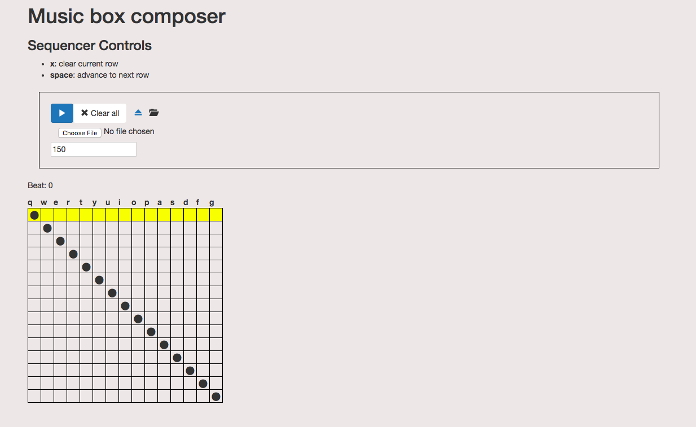

# music-box-composer

A web app for music composition and discovery.



Goals of this project:
* [x] implement a sequencer 
* [x] experiment with [React](https://facebook.github.io/react/)/[Webpack](http://webpack.github.io/)/[Babel](https://babeljs.io/)
* [x] build a ~~useful~~ tool for ~~composing tunes for a custom music box~~ making annoying, repetitive sounds 

### To run

* Install the dependencies:

```
npm install
```

* Run development server:

```
npm start
```

* Or you can run development server with [webpack-dashboard](https://github.com/FormidableLabs/webpack-dashboard):

```
npm run dev
```

Open the web browser to `http://localhost:8888/`

### To build the production package

```
npm run build
```

